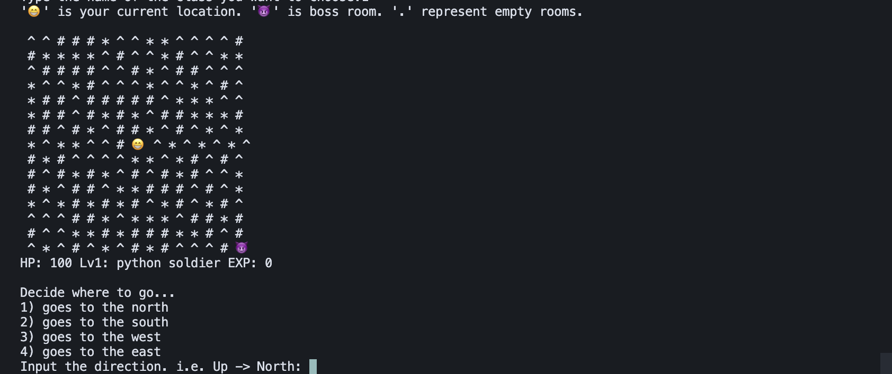
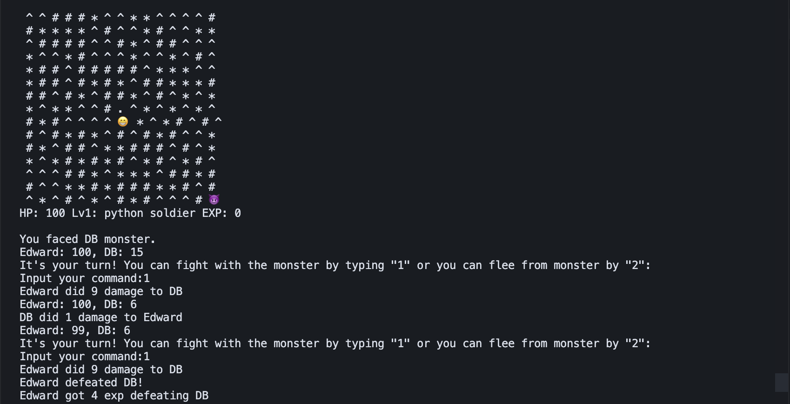
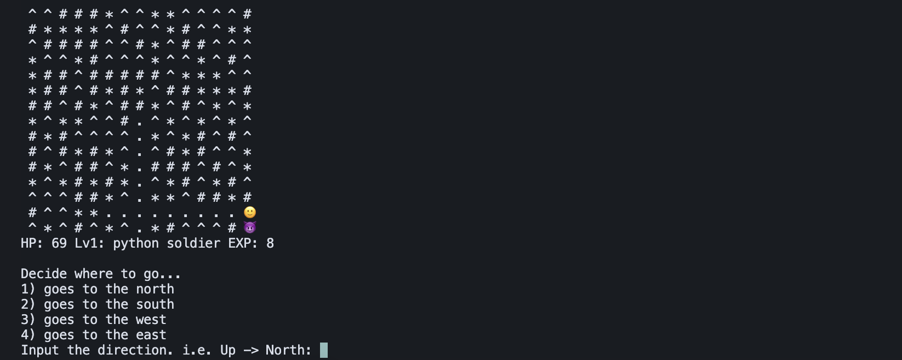
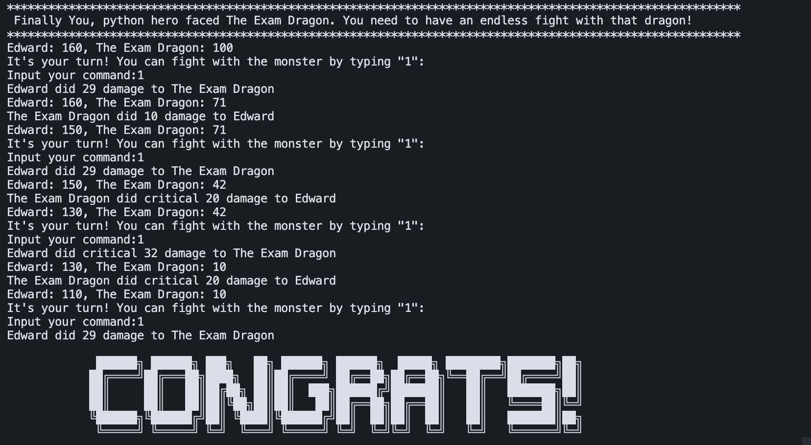

# simple-python-game
a text-based narrative game with a 2D terminal board interface & unit tests for the game

## Intro 

- My game is inspired by my CS journey. There are monsters that are named as course names and the boss, Exam Dragon.
- Some monsters are so dangerous. i.e. DB or AI/ML could kill you right away!
- Every character is able to give its critical damage with a 25% chance
- The user has only one option to win this game: defeating the exam dragon. The exam dragon will copy the character's passive skill as itself.
- The user has two options to get to the boss: directly going to the boss's room or getting level 3 and killing normal monsters.
- The character will be able to flee only when fighting normal monsters.

- Player can select their character from 4 classes:
    - `Python Soldier`: this character has a decent level of ability for each
    - `Web Dev Assassin`: this character has its passive "employ's legend", which has a 50% chance of dealing critical damage.
    - `DB Guardian`: this character has its passive "security", which is able to dodge the enemy's damage by half in a 33% chance.
    - `Project sorcerer`: this character has its passive "agile", that gains twicethe  exp from normal monsters and has the highest critical damage

## How to play
#### After the player selects their name and class, the board will be shown up as below:

#### While the screen is refreshed in real time, this is when the player chooses to move south and have a battle against the monster:

### The player can choose two options:
#### Either go directly to the Boss

#### Either be automatically moved when they reach their max level



## File Structure

```
simple-python-game/
├── game.py
├── LICENSE
├── README.md
└── testfiles/
    ├── __init__.py
    ├── test_attack.py
    ├── test_boss_monster_generator.py
    ├── test_character_icon_generator.py
    ├── test_check_character_attributes.py
    ├── test_check_level_up.py
    ├── test_class_attributes.py
    ├── test_critical_counter.py
    ├── test_damage_dodger.py
    ├── test_db_guardian_attributes.py
    ├── test_describe_location.py
    ├── test_fight_with_boss.py
    ├── test_fight.py
    ├── test_gain_exp.py
    ├── test_generate_character_attributes.py
    ├── test_generate_character.py
    ├── test_get_class.py
    ├── test_get_command.py
    ├── test_get_name.py
    ├── test_get_user_choice.py
    ├── test_is_alive.py
    ├── test_is_boss.py
    ├── test_is_character_level_3.py
    ├── test_is_flee.py
    ├── test_is_this_alphabet_word.py
    ├── test_make_board.py
    ├── test_map_renderer.py
    ├── test_move_character.py
    ├── test_norm_monster_generator.py
    ├── test_project_sorcerer_attributes.py
    ├── test_python_warrior_attributes.py
    ├── test_room_generator.py
    ├── test_show_result.py
    ├── test_update_char_attr.py
    ├── test_validate_move.py
    └── test_web_dev_assassin_attributes.py
```
